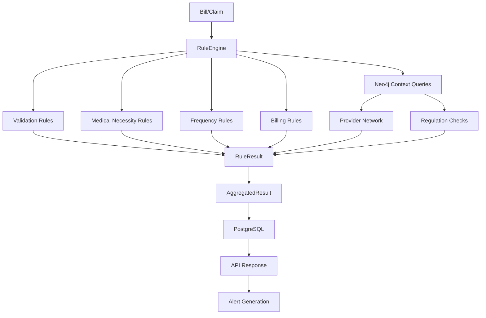

# Phase 3: Rules Engine Implementation Plan

## Overview

Phase 3 implements the rules engine for healthcare billing fraud detection and compliance verification. The rules engine validates medical bills against multiple rule types including coding rules, medical necessity, frequency limits, and billing constraints.

**Objective**: Build a comprehensive, performant rules engine that follows existing codebase patterns and integrates seamlessly with PostgreSQL and Neo4j.

**Status**: Planning Phase
**Branch**: sisyphus_GLM-4.7/rules-engine-implementation
**Previous**: Phase 2 - Knowledge Graph Construction (Complete)

---

## Architecture Design

### System Overview

The rules engine follows a **hybrid pattern** combining class-based rules with configuration-driven parameters:

1. **RuleEngine Orchestrator** - Central coordinator that manages rule execution
2. **Rule Validators** - Domain-specific rule implementations (coding, medical necessity, frequency, billing)
3. **Rule Chain** - Prioritized execution with early termination for critical decisions
4. **Result Aggregation** - Combines rule results into composite scores
5. **Database Integration** - Uses PostgreSQL for rule results, Neo4j for context queries

### Architecture Diagram



### Data Flow

```
Bill Request → RuleEngine.load_rules()
              → RuleChain.execute()
              → [Validation Rules] → RuleResult
              → [Medical Necessity Rules] → RuleResult
              → [Frequency Rules] → RuleResult
              → [Billing Rules] → RuleResult
              → ResultAggregator.aggregate()
              → PostgreSQL.save_results()
              → API Response (fraud_score, compliance_score, issues)
```

---

## Three Implementation Approaches

### Approach 1: Simple Class-Based Rules Engine (RECOMMENDED)

**Description**: Use Python classes for each rule type with a central RuleEngine orchestrator.

**Pros**:
- ✅ Simple, explicit, easy to understand
- ✅ Type-safe with Pydantic models
- ✅ Easy to test with pytest
- ✅ Follows existing codebase patterns
- ✅ Good performance with pre-compiled rules
- ✅ Clear separation of concerns

**Cons**:
- ⚠️ Requires code changes to add/modify rules
- ⚠️ Less flexible for runtime rule updates

**Implementation**:
```python
# backend/app/core/rules_engine.py
class RuleEngine:
    def __init__(self, db: AsyncSession, neo4j: AsyncSession):
        self.db = db
        self.neo4j = neo4j
        self.rule_chain = RuleChain()
        self._initialize_rules()

    def _initialize_rules(self):
        self.rule_chain.add_rule(ICD10ValidationRule(priority=10))
        self.rule_chain.add_rule(CPTValidationRule(priority=10))
        self.rule_chain.add_rule(DXPairValidationRule(priority=20))
        self.rule_chain.add_rule(MedicalNecessityRule(priority=30))
        self.rule_chain.add_rule(FrequencyLimitRule(priority=30))
        self.rule_chain.add_rule(AmountLimitRule(priority=40))
```

**Why Recommended**: Balances simplicity with future extensibility. Aligns with existing async patterns, easy to integrate with Neo4j for context queries, and prepares foundation for Phase 4 ML integration.

---

### Approach 2: JSON-Based Configuration Rules Engine

**Description**: Define rules in JSON/YAML files loaded at runtime.

**Pros**:
- ✅ Highly configurable without code changes
- ✅ Rules can be updated in production
- ✅ Non-technical users can modify rules

**Cons**:
- ❌ Loses type safety
- ❌ Harder to test complex rules
- ❌ JSON validation errors at runtime
- ❌ Slower performance (rule compilation at runtime)
- ❌ Harder to debug

**Implementation**:
```python
# rules/coding_rules.json
{
  "rules": [
    {
      "id": "ICD10_FORMAT",
      "name": "ICD-10 Format Validation",
      "priority": 10,
      "conditions": [
            {"field": "diagnosis_code", "pattern": "^[A-Z]\\d{2}\\.?\\d{0,4}$"}
        ]
    }
  ]
}
```

**Why Not Recommended**: Adds complexity without clear benefit. Medical billing rules require complex logic that's hard to express in JSON. Type safety is critical for healthcare compliance.

---

### Approach 3: Template-Based Virtual Rules (Aether Pattern)

**Description**: Use templates that can be composed at runtime with virtual rule generation.

**Pros**:
- ✅ Most flexible - can generate rules dynamically
- ✅ Supports complex scenarios
- ✅ Good for billing systems with many similar rules

**Cons**:
- ❌ Most complex implementation
- ❌ Harder to understand initially
- ❌ Potential performance overhead with rule composition
- ❌ Requires sophisticated template system

**Implementation**:
```python
@dataclass(frozen=True)
class BillingRuleTemplate:
    name: str
    description: str
    priority: int = 0
    match: MatchFn = None
    build: BuildFn = None

class VirtualBillingRule:
    def __init__(self, id: str, expression: str, variables: dict):
        self.id = id
        self.expression = expression  # Runtime formula evaluation
        self.variables = variables
```

**Why Not Recommended**: Overkill for current requirements. We don't need dynamic rule generation yet. Simpler Approach 1 can be extended if needed.

---

## Recommended Implementation: Approach 1 with Best Practices

### Architecture Decisions

**1. Rule Base Class**
```python
class BaseRule(ABC):
    """Base class for all rule types."""

    @property
    @abstractmethod
    def rule_id(self) -> str:
        """Unique rule identifier."""
        pass

    @property
    @abstractmethod
    def priority(self) -> int:
        """Rule execution priority (lower = earlier)."""
        pass

    @abstractmethod
    async def evaluate(self, bill: Bill, context: Dict[str, Any]) -> RuleResult:
        """Evaluate bill against this rule."""
        pass
```

**2. Rule Chain with Prioritization**
```python
class RuleChain:
    def __init__(self):
        self.rules: List[BaseRule] = []

    def add_rule(self, rule: BaseRule) -> None:
        self.rules.append(rule)
        self.rules.sort(key=lambda r: r.priority)

    async def execute(self, bill: Bill) -> ChainResult:
        """Execute rules in priority order with early termination."""
        results = []
        context = {"bill": bill}

        for rule in self.rules:
            result = await rule.evaluate(bill, context)
            results.append(result)

            # Early termination for critical decisions
            if result.is_critical:
                break

            context.update(result.context_updates)

        return ChainResult(results=results, final_decision=self._decide(results))
```

**3. Context Enrichment with Neo4j**
```python
async def enrich_context(bill: Bill, neo4j: AsyncSession) -> Dict[str, Any]:
    """Enrich bill context with graph data."""
    # Query provider network
    provider_query = """
    MATCH (p:Provider {npi: $npi})-[:PROVIDES_AT]->(h:Hospital)
    RETURN p.name, h.name, h.hospital_type
    """
    # Query regulations
    regulation_query = """
    MATCH (r:Regulation)-[:APPLIES_TO]->(:Bill {claim_id: $claim_id})
    RETURN r.code, r.category
    """
    # Merge into context for rule evaluation
    return enriched_context
```

---

## File Structure

```
backend/app/
├── core/
│   ├── __init__.py
│   ├── database.py (existing)
│   ├── neo4j.py (existing)
│   └── rules_engine.py (NEW) - RuleEngine orchestrator
├── rules/ (NEW directory)
│   ├── __init__.py
│   ├── base.py - BaseRule abstract class, RuleResult dataclass
│   ├── coding_rules.py - CPT/ICD-10 validation, bundling, modifiers
│   ├── medical_necessity_rules.py - Evidence-based necessity validation
│   ├── frequency_rules.py - Frequency limits, geographic constraints
│   └── billing_rules.py - Amount limits, duplicate detection
├── models/
│   ├── bill.py (existing)
│   ├── provider.py (existing)
│   └── compliance_check.py (existing)
└── api/
    ├── bills.py (modify - update /validate endpoint)
    └── compliance.py (NEW - /api/v1/bills/{claim_id}/compliance)

scripts/
└── validate_bills.py (NEW) - Standalone script for rule execution

tests/
└── test_rules_engine.py (NEW) - Comprehensive unit tests

docs/
└── RULES_ENGINE_STATE_MACHINE.md (NEW) - State machine diagram
```

---

## Core Components

### 1. RuleEngine (backend/app/core/rules_engine.py)

**Responsibilities**:
- Load and initialize all rule types
- Manage rule chain with prioritization
- Execute rule evaluation for bills
- Aggregate results into composite scores
- Save rule results to PostgreSQL

**Key Methods**:
```python
class RuleEngine:
    async def evaluate_bill(self, bill_id: str) -> EvaluationResult:
        """Evaluate bill against all rules."""
        pass

    async def batch_evaluate(self, bill_ids: List[str]) -> List[EvaluationResult]:
        """Batch evaluate multiple bills."""
        pass

    async def get_rule_results(self, bill_id: str) -> List[RuleResult]:
        """Retrieve saved rule results from database."""
        pass
```

---

### 2. Coding Rules (backend/app/rules/coding_rules.py)

**Rules to Implement**:
- **ICD10ValidationRule**: Validate ICD-10 format (Letter + 2 digits + optional decimal)
- **CPTValidationRule**: Validate CPT code exists and is active
- **DXPairValidationRule**: Validate CPT-ICD pairing for medical necessity
- **BundlingRule**: Check for unbundling violations (separate charges for bundled procedures)
- **ModifierRule**: Validate CPT modifiers are appropriate

**Data Sources**:
- BillingCode table in PostgreSQL
- CodeRelationship table for bundling rules
- CMS guidelines for valid pairs

---

### 3. Medical Necessity Rules (backend/app/rules/medical_necessity_rules.py)

**Rules to Implement**:
- **DocumentationCompletenessRule**: Check documentation_text has required fields
- **MedicalNecessityScoreRule**: Calculate necessity score based on CPT-ICD pairing
- **CoverageVerificationRule**: Verify procedure is covered by insurer
- **EvidenceMatchingRule**: Match diagnosis to treatment evidence

**Data Sources**:
- Bill.documentation_text
- Provider.specialty
- Insurance coverage tables
- Clinical guidelines

---

### 4. Frequency Rules (backend/app/rules/frequency_rules.py)

**Rules to Implement**:
- **ProcedureFrequencyRule**: Check provider hasn't billed procedure too frequently
- **PatientFrequencyRule**: Check patient hasn't received procedure too often
- **GeographicConstraintRule**: Validate service location is reasonable
- **TimePatternRule**: Detect unusual billing patterns (e.g., weekend surgeries)

**Data Sources**:
- Historical bills in PostgreSQL
- Provider specialty norms
- Geographic distance calculations

---

### 5. Billing Rules (backend/app/rules/billing_rules.py)

**Rules to Implement**:
- **AmountLimitRule**: Check billed_amount doesn't exceed allowed amount
- **DuplicateDetectionRule**: Detect duplicate bills (same patient, provider, procedure, date)
- **UpcodingDetectionRule**: Check if higher code used than justified
- **UnbundlingDetectionRule**: Detect procedures that should be billed together

**Data Sources**:
- Bill amounts
- Provider historical norms
- Payer fee schedules
- Duplicate bill queries

---

## Performance Optimization

### 1. Caching Strategy
```python
from functools import lru_cache

class CachedRuleEngine:
    @lru_cache(maxsize=1000)
    async def _get_billing_codes(self, code: str) -> BillingCode:
        """Cache billing code lookups."""
        pass
```

### 2. Batch Processing
```python
class RuleEngine:
    async def batch_evaluate(self, bill_ids: List[str]) -> List[EvaluationResult]:
        """Batch evaluate for performance."""
        tasks = [self.evaluate_bill(bid) for bid in bill_ids]
        return await asyncio.gather(*tasks)
```

### 3. Database Optimization
```python
# Use indexed queries
stmt = (
    select(Bill)
    .where(Bill.claim_id == claim_id)
    .options(selectinload(Bill.provider))
)
```

### 4. Parallel Rule Execution
```python
# Rules can execute in parallel if independent
async def execute_parallel(self, rules: List[BaseRule], bill: Bill) -> List[RuleResult]:
    tasks = [rule.evaluate(bill, {}) for rule in rules]
    return await asyncio.gather(*tasks)
```

---

## Edge Cases and Solutions

### Edge Case 1: Missing Optional Fields
**Problem**: Bill might not have all required fields for certain rules.

**Solution**:
```python
class BaseRule:
    async def evaluate(self, bill: Bill, context: Dict[str, Any]) -> RuleResult:
        if not self._has_required_fields(bill):
            return RuleResult(
                rule_id=self.rule_id,
                passed=None,  # Skip rule
                skipped=True,
                message=f"Missing required fields: {self._missing_fields}"
            )
```

### Edge Case 2: Circular Rule Dependencies
**Problem**: Rules might depend on each other creating loops.

**Solution**: Use priority-based execution, not dependency graph. Each rule is independent.

### Edge Case 3: Conflicting Rule Results
**Problem**: One rule passes, another fails for same bill.

**Solution**: Weighted scoring with configurable thresholds.
```python
def aggregate_results(results: List[RuleResult]) -> AggregatedResult:
    score = sum(r.weight * r.score for r in results if r.passed)
    return AggregatedResult(
        score=score,
        decision="APPROVE" if score > 0.7 else "REVIEW"
    )
```

### Edge Case 4: Database Connection Failures
**Problem**: Neo4j or PostgreSQL unavailable.

**Solution**: Graceful degradation
```python
class RuleEngine:
    async def evaluate_bill(self, bill_id: str) -> EvaluationResult:
        try:
            context = await self._enrich_context(bill_id)
        except DatabaseError:
            logger.warning(f"Neo4j unavailable, evaluating without context")
            context = {}
        # Continue with limited context
```

---

## Integration with Existing Systems

### PostgreSQL Integration
```python
async with get_db() as db:
    # Load bill with relationships
    stmt = select(Bill).where(Bill.claim_id == claim_id)
    bill = (await db.execute(stmt)).scalar_one_or_none()

    # Save rule results
    for result in rule_results:
        db.add(ComplianceCheck(...))
    await db.commit()
```

### Neo4j Integration
```python
async with get_neo4j() as neo4j:
    # Query provider network
    result = await neo4j.run(query, parameters={"npi": provider.npi})
    records = [record.data() for record in await result.data()]
    # Use for rule context
```

### API Integration
```python
# backend/app/api/bills.py
@router.post("/validate", response_model=BillValidationResponse)
async def validate_bill(
    bill: BillValidationRequest,
    db: AsyncSession = Depends(get_db),
    neo4j: AsyncSession = Depends(get_neo4j),
    user_id: str = Depends(require_auth)
):
    engine = RuleEngine(db, neo4j)
    result = await engine.evaluate_bill(bill.claim_id)
    return BillValidationResponse(
        claim_id=result.claim_id,
        fraud_score=result.fraud_score,
        compliance_score=result.compliance_score,
        issues=result.issues,
        warnings=result.warnings
    )
```

---

## Testing Strategy

### Unit Tests (tests/test_rules_engine.py)
```python
@pytest.mark.asyncio
async def test_icd10_validation_rule():
    rule = ICD10ValidationRule()
    bill = Bill(diagnosis_code="I10")  # Valid
    result = await rule.evaluate(bill, {})
    assert result.passed == True

@pytest.mark.asyncio
async def test_icd10_invalid_format():
    rule = ICD10ValidationRule()
    bill = Bill(diagnosis_code="12345")  # Invalid
    result = await rule.evaluate(bill, {})
    assert result.passed == False
```

### Integration Tests
```python
@pytest.mark.asyncio
async def test_full_rule_execution(db, neo4j):
    # Create test bill
    bill = await create_test_bill(db)

    # Execute full rule chain
    engine = RuleEngine(db, neo4j)
    result = await engine.evaluate_bill(bill.claim_id)

    # Verify results
    assert result.compliance_score > 0
    assert len(result.issues) >= 0
```

### Performance Tests
```python
@pytest.mark.asyncio
async def test_batch_performance(db, neo4j):
    engine = RuleEngine(db, neo4j)

    # Create 1000 test bills
    bills = await create_test_bills(db, count=1000)
    bill_ids = [b.claim_id for b in bills]

    # Measure performance
    start = time.time()
    results = await engine.batch_evaluate(bill_ids)
    duration = time.time() - start

    # Assert < 10 seconds for 1000 bills
    assert duration < 10
```

---

## Acceptance Criteria

### Phase 3 Completion Requirements

- [ ] RuleEngine can evaluate multiple rule types (coding, medical necessity, frequency, billing)
- [ ] Rules can be prioritized and executed in order
- [ ] Rule results aggregated into composite scores (fraud_score, compliance_score)
- [ ] Comprehensive error handling and logging for all rule types
- [ ] Unit tests for all rule types with >80% coverage
- [ ] Performance optimized (batch evaluation, caching, <1s per bill)
- [ ] Integration with PostgreSQL for bill and compliance check storage
- [ ] Integration with Neo4j for context enrichment
- [ ] API endpoint `/api/v1/bills/validate` returns validated results
- [ ] Standalone script `scripts/validate_bills.py` for batch processing
- [ ] Documentation (RULES_ENGINE_STATE_MACHINE.md) with architecture diagrams
- [ ] README updated with rules engine architecture and usage

---

## Implementation Phases

### Phase 3.1: Core Infrastructure
- Create backend/app/core/rules_engine.py with RuleEngine class
- Create backend/app/rules/ directory structure
- Implement BaseRule abstract class
- Implement RuleResult and RuleChain dataclasses
- Implement unit tests for core infrastructure

### Phase 3.2: Rule Implementations
- Implement coding_rules.py with 5 coding validation rules
- Implement medical_necessity_rules.py with 4 necessity rules
- Implement frequency_rules.py with 4 frequency validation rules
- Implement billing_rules.py with 4 billing constraint rules
- Implement unit tests for all rule types

### Phase 3.3: API Integration
- Update /api/v1/bills/validate endpoint to use RuleEngine
- Create /api/v1/bills/{claim_id}/compliance endpoint
- Add error handling and logging
- Update API documentation

### Phase 3.4: Testing & Documentation
- Run comprehensive unit tests
- Create integration tests with real data
- Performance benchmarking
- Create RULES_ENGINE_STATE_MACHINE.md
- Update README with rules engine usage

---

## Risks and Mitigations

### Risk 1: Performance with Large Datasets
**Mitigation**:
- Use batch processing with configurable batch size
- Implement caching for frequently accessed data
- Optimize database queries with indexes
- Use parallel execution for independent rules

### Risk 2: Complexity of Medical Necessity
**Mitigation**:
- Start with simple validation (format, existence)
- Gradually add complex rules (documentation scoring, AI-assisted)
- Prepare for Phase 4 ML integration
- Use external medical guidelines for reference

### Risk 3: Rule Conflicts
**Mitigation**:
- Clear prioritization (validation rules first, then business rules)
- Early termination for critical rejections
- Weighted scoring for non-critical rules
- Log all rule executions for audit trails

---

## Next Steps

1. Create backend/app/rules/__init__.py and base.py
2. Implement RuleEngine orchestrator class
3. Implement each rule module with specific rules
4. Create comprehensive unit tests
5. Update API endpoints
6. Create standalone validation script
7. Document architecture and state machine
8. Test with sample data and validate performance

---

## References

- Phase 2 Session Handoff: `.research/SESSION_HANDOFF.md`
- Knowledge Graph State Machine: `docs/KNOWLEDGE_GRAPH_STATE_MACHINE.md`
- Rules Engine Research: [Librarian Agent Output - Python Rules Engines]
- Aether Billing System: [Virtual Rules Pattern]
- MedicalClaimVerifier: [AI-Powered Validation]
