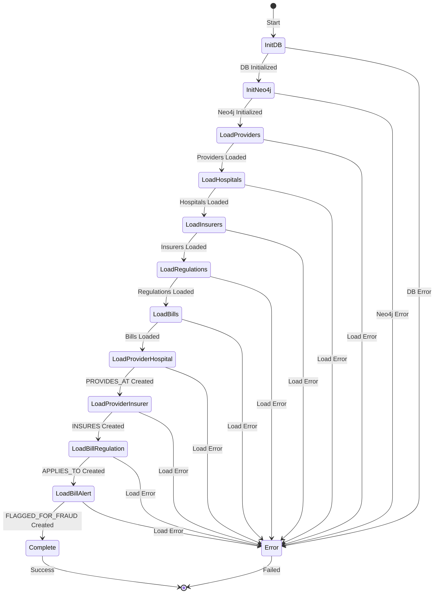
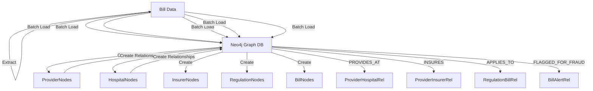

# Knowledge Graph Construction - State Machine Diagram

## System Overview

The knowledge graph construction system transforms PostgreSQL relational data into Neo4j graph data through a multi-phase orchestration process.

## State Machine



## State Descriptions

### 1. InitDB
**Purpose**: Initialize PostgreSQL database connection and schema
**Actions**:
- Connect to PostgreSQL via AsyncSessionLocal
- Run `init_db()` to create tables if needed
- Validate database connectivity

**Transitions**:
- ✅ Success → InitNeo4j
- ❌ Error → Error state

---

### 2. InitNeo4j
**Purpose**: Initialize Neo4j graph database with constraints and indexes
**Actions**:
- Connect to Neo4j via AsyncGraphDatabase.driver()
- Create unique constraints (NPI, payer_id, claim_id, etc.)
- Create performance indexes (name, type, state, etc.)
- Create full-text search indexes

**Constraints Created**:
```cypher
CREATE CONSTRAINT provider_npi_unique FOR (p:Provider) REQUIRE p.npi IS UNIQUE
CREATE CONSTRAINT hospital_npi_unique FOR (h:Hospital) REQUIRE h.npi IS UNIQUE
CREATE CONSTRAINT insurer_payer_id_unique FOR (i:Insurer) REQUIRE i.payer_id IS UNIQUE
CREATE CONSTRAINT regulation_code_unique FOR (r:Regulation) REQUIRE r.code IS UNIQUE
CREATE CONSTRAINT bill_claim_id_unique FOR (b:Bill) REQUIRE b.claim_id IS UNIQUE
CREATE CONSTRAINT patient_id_unique FOR (p:Patient) REQUIRE p.id IS UNIQUE
CREATE CONSTRAINT billing_code_code_unique FOR (c:BillingCode) REQUIRE c.code IS UNIQUE
```

**Indexes Created**:
- Provider: name, type, specialty, state, city
- Hospital: name, type, state
- Insurer: name, coverage_type, state
- Regulation: name, category, type
- Bill: date, amount, status
- Full-text: Provider name, Hospital name

**Transitions**:
- ✅ Success → LoadProviders
- ❌ Error → Error state

---

### 3. LoadProviders
**Purpose**: Load Provider nodes from PostgreSQL to Neo4j
**Actions**:
- Query PostgreSQL: `SELECT * FROM providers ORDER BY id`
- Process in batches (default: 1000 records)
- Use UNWIND + MERGE for performance
- Track statistics: nodes created, errors

**Query Pattern**:
```cypher
UNWIND $providers AS provider
MERGE (p:Provider {npi: provider.npi})
ON CREATE SET
    p.name = provider.name,
    p.provider_type = provider.provider_type,
    p.specialty = provider.specialty,
    ...
ON MATCH SET
    p.name = provider.name,
    p.updated_at = provider.updated_at
```

**Batch Size**: Configurable via `INGEST_BATCH_SIZE` (default: 1000)

**Transitions**:
- ✅ Success → LoadHospitals
- ❌ Error → Error state

---

### 4. LoadHospitals
**Purpose**: Load Hospital nodes from PostgreSQL to Neo4j
**Actions**:
- Query PostgreSQL: `SELECT * FROM hospitals ORDER BY id`
- Process in batches
- Use UNWIND + MERGE pattern

**Transitions**:
- ✅ Success → LoadInsurers
- ❌ Error → Error state

---

### 5. LoadInsurers
**Purpose**: Load Insurer nodes from PostgreSQL to Neo4j
**Actions**:
- Query PostgreSQL: `SELECT * FROM insurers ORDER BY id`
- Process in batches
- Use UNWIND + MERGE pattern

**Transitions**:
- ✅ Success → LoadRegulations
- ❌ Error → Error state

---

### 6. LoadRegulations
**Purpose**: Load Regulation nodes from PostgreSQL to Neo4j
**Actions**:
- Query PostgreSQL: `SELECT * FROM regulations WHERE is_active = true`
- Filter for active regulations only
- Process in batches

**Transitions**:
- ✅ Success → LoadBills
- ❌ Error → Error state

---

### 7. LoadBills
**Purpose**: Load Bill and Patient nodes from PostgreSQL to Neo4j
**Actions**:
- Query PostgreSQL: `SELECT * FROM bills ORDER BY bill_date DESC LIMIT 1000000`
- First create Patient nodes (MERGE)
- Then create Bill nodes with HAS_BILL relationships
- Use provider_id → provider_npi mapping

**Transitions**:
- ✅ Success → LoadProviderHospital
- ❌ Error → Error state

---

### 8. LoadProviderHospital
**Purpose**: Create PROVIDES_AT relationships between Providers and Hospitals
**Actions**:
- Query: `SELECT p.npi, h.npi FROM hospital_provider JOIN providers JOIN hospitals`
- Batch process provider-hospital pairs
- Create: `(p:Provider)-[:PROVIDES_AT]->(h:Hospital)`

**Query Pattern**:
```cypher
UNWIND $pairs AS pair
MATCH (p:Provider {npi: pair.provider_npi})
MATCH (h:Hospital {npi: pair.hospital_npi})
MERGE (p)-[r:PROVIDES_AT]->(h)
ON CREATE SET r.created_at = $timestamp
```

**Transitions**:
- ✅ Success → LoadProviderInsurer
- ❌ Error → LoadProviderInsurer (degraded, continue)

---

### 9. LoadProviderInsurer
**Purpose**: Create INSURES relationships between Providers and Insurers
**Actions**:
- Query: `SELECT p.npi, i.payer_id FROM provider_insurer JOIN providers JOIN insurers`
- Batch process provider-insurer pairs
- Create: `(p:Provider)-[:INSURES]->(i:Insurer)`

**Transitions**:
- ✅ Success → LoadBillRegulation
- ❌ Error → LoadBillRegulation (degraded, continue)

---

### 10. LoadBillRegulation
**Purpose**: Create APPLIES_TO relationships between Regulations and Bills
**Actions**:
- Query: `SELECT b.claim_id, r.code FROM compliance_check JOIN bills JOIN regulations`
- Filter: non-compliant OR high severity
- Create: `(r:Regulation)-[:APPLIES_TO]->(b:Bill)`

**Transitions**:
- ✅ Success → LoadBillAlert
- ❌ Error → LoadBillAlert (degraded, continue)

---

### 11. LoadBillAlert
**Purpose**: Create FLAGGED_FOR_FRAUD relationships between Bills and Alerts
**Actions**:
- Query: `SELECT b.claim_id, a.id FROM alerts JOIN bills`
- Filter: fraud alerts OR high severity
- Create: `(b:Bill)-[:FLAGGED_FOR_FRAUD]->(a:Alert)`

**Transitions**:
- ✅ Success → Complete
- ❌ Error → Complete (degraded, continue)

---

### 12. Complete
**Purpose**: Graph construction completed successfully
**Actions**:
- Print summary statistics
- Close database connections
- Exit with success status

**Statistics Reported**:
- Duration (seconds)
- Total nodes created
- Total edges created
- Total errors

**Transitions**:
- ✅ → End state

---

### 13. Error
**Purpose**: Handle fatal errors that prevent continuation
**Actions**:
- Log error details
- Close database connections
- Exit with error status

**Error Types**:
- Database connection errors
- Neo4j connection errors
- Data integrity errors
- Query execution errors

**Transitions**:
- ✅ → End state

---

## Data Flow Diagram



## Performance Characteristics

### Batch Processing:
- **Default Batch Size**: 1000 records per UNWIND
- **Performance Gain**: 900x faster than individual queries
- **Configurable**: Via `INGEST_BATCH_SIZE` environment variable

### Idempotency:
- All node creation uses `MERGE` pattern
- Safe to retry operations
- No duplicate nodes created

### Transaction Safety:
- PostgreSQL: AsyncSession with auto-commit
- Neo4j: Session with automatic transaction
- Error handling: Rollback on failure

---

## Monitoring & Observability

### Logging Levels:
- INFO: Progress updates, batch completions
- WARNING: Non-fatal errors (relationship loading)
- ERROR: Fatal errors preventing continuation

### Statistics Tracked:
- Providers created
- Hospitals created
- Insurers created
- Regulations created
- Bills created
- Relationships created
- Errors encountered

---

## Error Recovery Strategy

### Non-Fatal Errors:
- Relationship loading warnings logged
- Continue with remaining phases
- Report in final summary

### Fatal Errors:
- Database connection failures
- Node loading failures
- Immediate abort and cleanup
- Exit with error code
