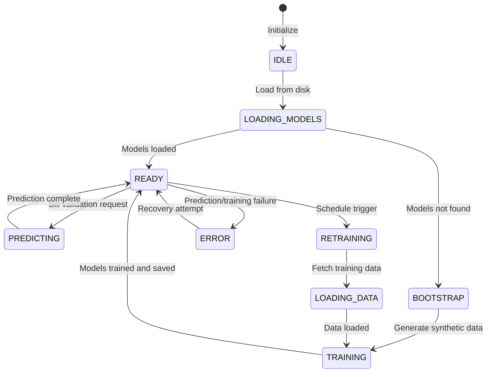

# ML Pipeline State Machine

## Overview

The ML pipeline manages model training, prediction, and lifecycle through 10 states with clear transitions and error recovery.

## State Machine Diagram



## State Descriptions

| State | Description | Entry Actions | Exit Conditions |
|--------|-------------|---------------|------------------|
| IDLE | System initialized, no models loaded | Log startup | Load models command |
| LOADING_MODELS | Attempting to load pre-trained models | Check disk, load joblib | Success → READY, Failure → BOOTSTRAP |
| BOOTSTRAP | No models found, generating synthetic training data | Create synthetic dataset | Data created → TRAINING |
| LOADING_DATA | Fetching historical training data from PostgreSQL | Query DB, engineer features | Data loaded → TRAINING |
| TRAINING | Model fitting in progress (RF/Isolation Forest) | Fit models, save to disk | Success → READY, Failure → ERROR |
| READY | Models loaded and ready for predictions | Log ready state | Predict request → PREDICTING, Retrain trigger → RETRAINING |
| PREDICTING | Generating fraud prediction for a bill | Load features, run inference | Prediction done → READY |
| RETRAINING | Scheduled model update triggered | Schedule job, load new data | Data loaded → LOADING_DATA |
| ERROR | Error in prediction/training | Log error, notify | Recovery ready → READY |

## Data Flow

```
PostgreSQL (Historical Data)
        ↓
  scripts/train_models.py
        ↓
  ML Models (RF, Isolation Forest)
        ↓
     Saved to Disk
        ↓
  MLModelEngine.load_model()
        ↓
   In-Memory Models
        ↓
   Prediction Request
        ↓
Fraud Probability (0-1)
```

## Error Recovery

| Error | Recovery Strategy | State Transition |
|--------|------------------|------------------|
| Model not found on load | Generate synthetic training data | LOADING_MODELS → BOOTSTRAP |
| Training data empty | Use bootstrap mode | LOADING_DATA → BOOTSTRAP |
| Prediction timeout | Use rule-only fallback | PREDICTING → READY (with warning) |
| Model version mismatch | Trigger retraining | READY → RETRAINING |
| Neo4j unavailable | Return neutral network scores | READY (with reduced weights) |
| Insufficient training samples | Use synthetic augmentation | TRAINING (with augmentation) |
| Model training failed | Retry with reduced parameters | RETRAINING |

## Performance Characteristics

| Operation | Typical Duration | Throughput |
|------------|-------------------|-------------|
| Load models (from disk) | 500ms - 2s | N/A |
| Train Random Forest (10k samples) | 30s - 2min | 333 samples/s |
| Train Isolation Forest (10k samples) | 10s - 30s | 333 samples/s |
| Predict (single bill) | 10ms - 50ms | 20-100 predictions/s |
| Retrain (incremental) | 5s - 15s | N/A |

## Monitoring

**Key Metrics to Track**:
- Models loaded successfully
- Training data volume (samples, fraud ratio)
- Prediction accuracy/precision/recall (via labeled feedback)
- Model version deployed
- Retraining frequency
- Error rate (prediction failures, training failures)

**Alert Thresholds**:
- Prediction latency > 1s → Investigate model size
- Training duration > 5min → Check data volume
- Error rate > 5% → Review model quality
- Model version mismatch → Review training pipeline
