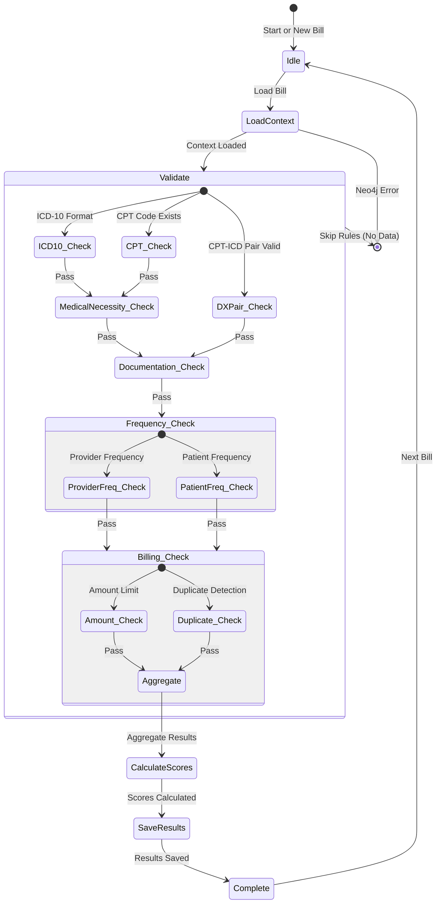

# Rules Engine State Machine

## Overview

The rules engine is a component of the healthcare fraud detection system that validates medical bills against compliance rules. It works in conjunction with the knowledge graph (Neo4j) and operational database (PostgreSQL).

## State Machine Diagram

## State Descriptions

### 1. Idle
**Trigger**: System start, no bill to process
**Exit**: `load_bill()`

### 2. Load Context
**Action**: Load bill from PostgreSQL, enrich with Neo4j context
**Exit**: `validate_rules`

**Error Handling**:
- If bill not found in PostgreSQL → HTTP 404 error
- If Neo4j unavailable → Log warning, continue with limited context

### 3. Validate Rules

Each rule is evaluated independently with early termination:
- **Critical rejection** (e.g., exact duplicate): Skip remaining rules, REJECT
- **Critical approval** (rare): Skip remaining rules, APPROVE
- Otherwise: Evaluate all rules in priority order

#### 3.1 ICD-10 Format Check (Priority 10)
**Rule**: `ICD10ValidationRule`
**Check**: ICD-10 code format (Letter + 2 digits + optional decimal)
**Exit**: Medical Necessity Check

#### 3.2 CPT Code Validation (Priority 10)
**Rule**: `CPTValidationRule`
**Check**: CPT code exists in billing codes and is active
**Exit**: DX Pair Check

#### 3.3 DX Pair Validation (Priority 20)
**Rule**: `DXPairValidationRule`
**Check**: CPT-ICD pairing is medically valid
**Exit**: Medical Necessity Check

### 4. Medical Necessity Check (Priority 15-25)

#### 4.1 Documentation Completeness (Priority 15)
**Rule**: `DocumentationCompletenessRule`
**Check**: Clinical documentation meets minimum length
**Exit**: Medical Necessity Score

#### 4.2 Medical Necessity Score (Priority 25)
**Rule**: `MedicalNecessityScoreRule`
**Check**: Pre-calculated score or CPT-ICD pairing
**Exit**: Frequency Check

### 5. Frequency Check (Priority 30)

#### 5.1 Provider Frequency (Priority 30)
**Rule**: `ProcedureFrequencyRule`
**Check**: Provider hasn't billed same procedure >50 times in 30 days
**Exit**: Billing Check

#### 5.2 Patient Frequency (Priority 30)
**Rule**: `PatientFrequencyRule`
**Check**: Patient hasn't received same procedure >10 times in 90 days
**Exit**: Billing Check

### 6. Billing Check (Priority 10-35)

#### 6.1 Amount Limit (Priority 35)
**Rule**: `AmountLimitRule`
**Check**: Billed amount doesn't exceed allowed by >20%
**Exit**: Duplicate Detection

#### 6.2 Duplicate Detection (Priority 10)
**Rule**: `DuplicateDetectionRule`
**Check**: Exact or near-duplicate bills exist
**Exit**: Aggregate Results
**Critical**: Exact duplicate = FATAL rejection

### 7. Aggregate Results
**Action**: Combine rule results into composite scores

**Fraud Score Calculation**:
- Start with base score: 0.0
- Add weight * score for each failed rule
- Cap at 1.0

**Compliance Score Calculation**:
- Start with perfect score: 1.0
- Deduct weight * score for each failed rule
- Ensure minimum 0.0

**Final Decision**:
- Fatal failures → REJECTED
- Skipped rules → PENDING
- Non-fatal failures with warnings → REVIEW_REQUIRED
- Non-fatal failures without warnings → REJECTED
- All passed → APPROVED

### 8. Calculate Scores
**Action**: Apply scoring algorithms
**Exit**: Save Results

### 9. Save Results
**Action**: Save compliance checks to PostgreSQL
**Exit**: Complete

**Data Flow**:
1. For each rule result that didn't skip:
   - Create ComplianceCheck record
   - Link to bill and regulation (if applicable)
   - Save status: PASSED or FAILED

### 10. Complete
**Trigger**: All results saved
**Exit**: Idle (ready for next bill)

## Error Recovery

### Load Context Failures
- **Neo4j unavailable**: Log warning, continue without graph context
- **Bill not found**: Raise HTTP 404
- **Database connection error**: Retry 3 times, then fail

### Rule Execution Failures
- **Single rule fails**: Log error, continue with remaining rules
- **All rules fail**: Log error, return REJECTED with error message
- **Timeout**: Log warning, return REVIEW_REQUIRED

### Save Failures
- **Database write error**: Log error, return error response
- **Constraint violation**: Log error, return error response

## Performance Characteristics

| Operation | Expected Time | Notes |
|------------|----------------|-------|
| Load bill from PostgreSQL | 10-50ms | Indexed query |
| Enrich context (Neo4j) | 50-200ms | Depends on query complexity |
| Single rule evaluation | 1-5ms | Simple validation rules |
| Full rule chain | 10-50ms | 9 rules total |
| Save compliance checks | 20-100ms | Batch insert |
| Total per bill | 50-400ms | Target <1s |

### Optimization Strategies

1. **Rule Prioritization**: Fast validation rules first (priority 1-10)
2. **Early Termination**: Stop rule chain on critical decisions
3. **Batch Processing**: Support batch evaluation with configurable batch size
4. **Connection Pooling**: PostgreSQL and Neo4j connection pools
5. **Lazy Loading**: Load only required data from PostgreSQL
6. **Context Caching**: Cache frequently accessed billing codes (future)

## Monitoring & Observability

### Key Metrics

- Bills evaluated per minute
- Average rule execution time
- Rule pass/fail rates
- Fraud score distribution
- Compliance score distribution
- Database query performance
- Neo4j query performance

### Logging Levels

- **INFO**: Rule evaluation starts/ends, bill validation results
- **WARNING**: Skipped rules, Neo4j unavailable, partial failures
- **ERROR**: Database errors, rule execution errors, critical failures
- **DEBUG**: Detailed rule evaluation, query details

### Health Checks

- PostgreSQL connection pool health
- Neo4j driver connection health
- Rule chain initialization status
- Error rate by rule type
- Average evaluation latency

## Integration Points

### PostgreSQL
- **Bill table**: Load bill records
- **ComplianceCheck table**: Save rule results
- **Indexing**: claim_id, provider_id, bill_date for fast queries

### Neo4j
- **Provider node**: Provider network relationships
- **Regulation node**: Applicable regulations
- **Relationships**: PROVIDES_AT, INSURES, APPLIES_TO

### API
- **POST /api/v1/bills/validate**: Single bill validation
- **GET /api/v1/bills/{claim_id}/compliance**: Compliance status
- **Response**: BillValidationResponse with scores, issues, warnings

## Future Enhancements

### Phase 4 Capabilities
- ML-based fraud scoring integration
- Network analysis for provider-patient relationships
- Statistical anomaly detection
- Real-time rule updates

### Performance Improvements
- Rule pre-compilation
- Result caching
- Parallel rule execution (where independent)
- Async database operations for all saves

### Feature Additions
- Rule versioning and rollback
- Rule explanation generation (natural language)
- Custom rule configuration via API
- Rule performance profiling
