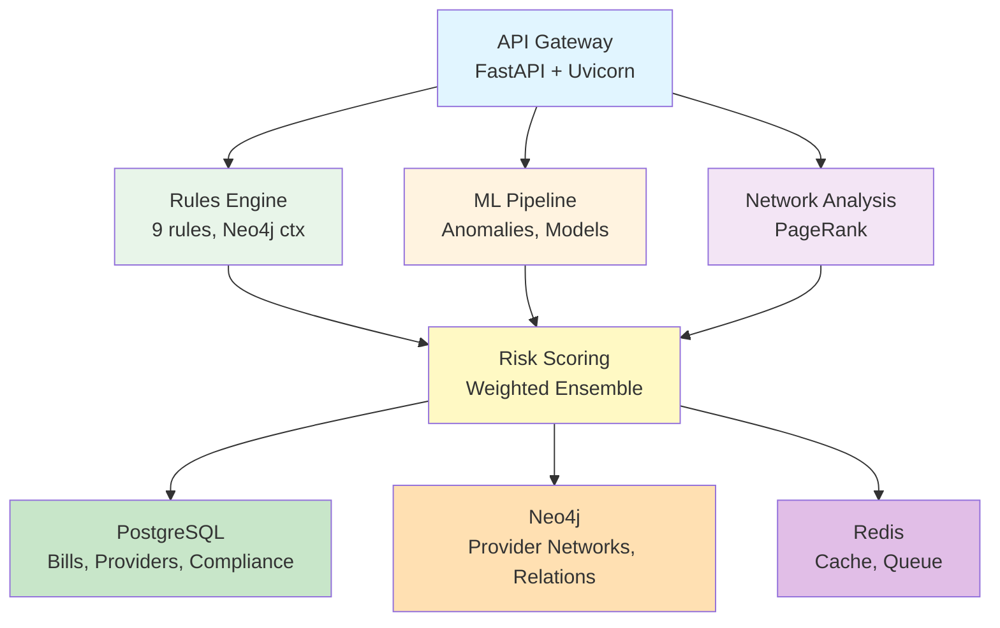
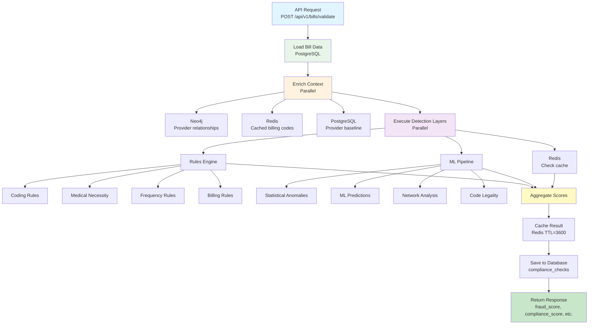
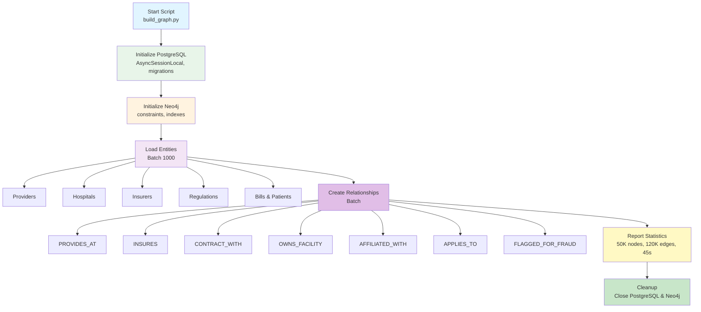
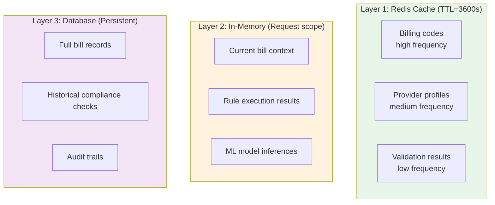
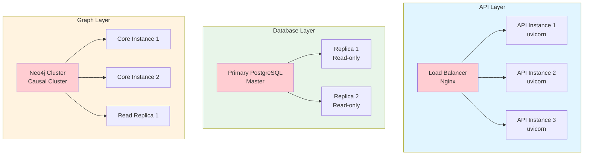

# Architecture Guide

**Tags**: #architecture #system-design #database #neo4j #postgresql #redis #ml #api #scalability #security

This document provides a comprehensive overview of the Healthcare Auditor system architecture, including components, data flow, and design decisions.

## Table of Contents

- [Overview](#overview)
- [High-Level Architecture](#high-level-architecture)
- [System Components](#system-components)
- [Data Flow](#data-flow)
- [Technology Stack](#technology-stack)
- [Database Schema](#database-schema)
- [Knowledge Graph Schema](#knowledge-graph-schema)
- [Security Architecture](#security-architecture)
- [Performance Considerations](#performance-considerations)
- [Scalability Strategy](#scalability-strategy)

---

## Overview

Healthcare Auditor is a multi-layered fraud detection system that combines:

1. **Rule-Based Validation** - 9 rules across 4 categories for immediate compliance checks
2. **Knowledge Graph Analysis** - Neo4j-based provider network analysis
3. **Machine Learning** - Statistical anomalies and ML models for fraud prediction
4. **Risk Scoring** - Weighted ensemble combining all detection layers

The system processes medical bills through these layers in parallel, providing comprehensive fraud and compliance scores.

---

## High-Level Architecture



---

## System Components

### 1. API Layer (FastAPI)

**Purpose**: HTTP API for external systems and internal services

**Endpoints**:
- `/api/v1/bills/validate` - Validate medical bills
- `/api/v1/bills/{claim_id}` - Retrieve bill details
- `/api/v1/providers` - Provider management
- `/api/v1/insurers` - Insurer management
- `/api/v1/knowledge-graph/*` - Graph queries
- `/api/v1/health` - Health checks

**Features**:
- Async I/O for high throughput
- Automatic OpenAPI documentation
- Request validation with Pydantic
- CORS support
- Rate limiting
- Authentication middleware

**File**: `backend/app/main.py`

---

### 2. Rules Engine

**Purpose**: Validate bills against compliance rules

**Components**:

#### Base Rule (`backend/app/rules/base.py`)
- Abstract rule interface
- Priority-based execution
- Error handling
- Result aggregation

#### Rule Implementations (`backend/app/rules/`)

| Category | Rules | File |
|----------|--------|-------|
| Coding Rules | ICD-10 validation, CPT existence, CPT-ICD pairs | `coding_rules.py` |
| Medical Necessity | Documentation completeness, Medical necessity score | `medical_necessity_rules.py` |
| Frequency Rules | Provider frequency, Patient frequency | `frequency_rules.py` |
| Billing Rules | Amount limits, Duplicate detection | `billing_rules.py` |

**Execution Flow**:
1. Load bill from PostgreSQL
2. Enrich with Neo4j context (provider relationships)
3. Execute rules in priority order
4. Early termination on critical decisions
5. Aggregate results into fraud and compliance scores

**File**: `backend/app/core/rules_engine.py`

---

### 3. Knowledge Graph (Neo4j)

**Purpose**: Model and analyze provider relationships

**Graph Schema**:

#### Nodes

| Label | Properties | Description |
|-------|------------|-------------|
| Provider | NPI, name, type, specialty, state | Healthcare providers |
| Hospital | NPI, name, type, beds | Medical facilities |
| Insurer | payer_id, name, coverage_type | Insurance companies |
| Regulation | code, name, category, type | Compliance regulations |
| Bill | claim_id, amounts, fraud_score | Medical claims |
| Patient | id | Patient records |
| BillingCode | code, type, description | CPT/HCPCS/ICD codes |

#### Relationships

| Relationship | From → To | Description |
|-------------|-------------|-------------|
| PROVIDES_AT | Provider → Hospital | Provider works at hospital |
| INSURES | Provider → Insurer | Provider accepts insurance |
| CONTRACT_WITH | Provider → Hospital | Formal contract relationship |
| OWNS_FACILITY | Provider → Hospital | Ownership relationship |
| AFFILIATED_WITH | Hospital → Hospital | System affiliation |
| APPLIES_TO | Regulation → Bill | Regulation applies to bill |
| FLAGGED_FOR_FRAUD | Bill → Alert | Bill flagged for fraud |

**Indexes & Constraints**:
- Unique constraints: NPI, payer_id, claim_id, billing codes
- Performance indexes: name, type, state, specialty
- Full-text search: Provider and Hospital names

**Files**:
- `backend/app/core/neo4j.py` - Connection management
- `backend/app/core/graph_builder.py` - Graph builder
- `scripts/build_graph.py` - Construction orchestrator

---

### 4. ML Pipeline

**Purpose**: Detect fraud patterns using machine learning

#### Statistical Anomaly Detection (`backend/app/core/anomaly_detection.py`)

| Algorithm | Purpose |
|-----------|---------|
| Z-score | Outlier detection on billed amounts |
| Benford's Law | Leading digit distribution analysis |
| Frequency Spike | Anomalous claim timestamps |

#### ML Models (`backend/app/core/ml_models.py`)

| Model | Type | Purpose |
|-------|-------|---------|
| Random Forest | Supervised | Trained fraud detection |
| Isolation Forest | Unsupervised | Anomaly detection |
| MLModelEngine | Ensemble | 70% supervised + 30% unsupervised |

#### Network Analysis (`backend/app/core/network_analysis.py`)

| Algorithm | Purpose |
|-----------|---------|
| PageRank | Provider influence scoring |
| Louvain Community | Provider cluster detection |
| WCC/SCC | Network segmentation |

#### Code Legality (`backend/app/core/code_legality.py`)

| Check | Purpose |
|-------|---------|
| CMS NCCI | Bundling rule verification |
| Fee Schedule | Payer-specific rates |
| LCD/NCD | Coverage verification |
| CPT-ICD Pair | Medical validity |

**Files**:
- `backend/app/core/anomaly_detection.py`
- `backend/app/core/ml_models.py`
- `backend/app/core/network_analysis.py`
- `backend/app/core/code_legality.py`
- `backend/app/core/risk_scoring.py`
- `scripts/train_models.py`

---

### 5. Risk Scoring Engine

**Purpose**: Combine all detection layers into composite scores

**Weighted Ensemble**:

| Component | Weight |
|-----------|---------|
| Rules Engine | 25% |
| ML Models | 35% |
| Network Analysis | 25% |
| NLP Analysis | 15% |
| Code Legality | 10% |

**Risk Levels**:
- **High**: Score ≥ 0.70 - Immediate investigation
- **Medium**: 0.40 ≤ Score < 0.70 - Priority review
- **Low**: Score < 0.40 - Normal processing

**File**: `backend/app/core/risk_scoring.py`

---

## Data Flow

### Bill Validation Flow



### Knowledge Graph Construction Flow



---

## Technology Stack

### Core Technologies

| Component | Technology | Version | Purpose |
|-----------|-----------|----------|---------|
| Web Framework | FastAPI | ^0.109.0 | Async API framework |
| Server | Uvicorn | ^0.30.0 | ASGI server |
| Database | PostgreSQL | 14+ | Operational data |
| Graph DB | Neo4j | 5.20+ | Knowledge graph |
| Cache | Redis | 7+ | Caching & queue |
| Task Queue | Celery | ^5.3.6 | Async processing |
| ORM | SQLAlchemy | ^2.0.30 | Database abstraction |
| Async Driver | asyncpg | ^0.29.0 | PostgreSQL async |
| Graph Driver | neo4j-python | ^5.20.0 | Neo4j client |

### ML & Analytics

| Component | Technology | Version | Purpose |
|-----------|-----------|----------|---------|
| ML Framework | scikit-learn | ^1.5.0 | ML models |
| Anomaly Detection | PyOD | ^1.1.3 | Outlier detection |
| Data Processing | pandas | ^2.2.0 | Data manipulation |
| Numerical Computing | numpy | ^2.1.0 | Array operations |

### Development Tools

| Component | Technology | Version | Purpose |
|-----------|-----------|----------|---------|
| Testing | pytest | ^8.2.0 | Unit & integration tests |
| Async Tests | pytest-asyncio | ^0.23.0 | Async test support |
| Coverage | pytest-cov | ^5.0.0 | Code coverage |
| Formatting | black | ^24.4.0 | Code formatter |
| Linting | ruff | ^0.3.0 | Code linter |
| Type Checking | mypy | ^1.9.0 | Static type checking |
| Dependency Manager | poetry | Latest | Python packaging |

---

## Database Schema

### PostgreSQL Schema

#### Bills Table
```sql
CREATE TABLE bills (
    claim_id VARCHAR(255) PRIMARY KEY,
    patient_id VARCHAR(255) NOT NULL,
    provider_id INTEGER NOT NULL REFERENCES providers(id),
    insurer_id INTEGER NOT NULL REFERENCES insurers(id),
    procedure_code VARCHAR(10) NOT NULL,
    diagnosis_code VARCHAR(10) NOT NULL,
    billed_amount DECIMAL(10,2) NOT NULL,
    bill_date TIMESTAMP NOT NULL,
    fraud_score DECIMAL(3,2) DEFAULT 0.0,
    compliance_score DECIMAL(3,2) DEFAULT 1.0,
    status VARCHAR(50) DEFAULT 'pending'
);
```

#### Providers Table
```sql
CREATE TABLE providers (
    id SERIAL PRIMARY KEY,
    npi VARCHAR(10) UNIQUE NOT NULL,
    name VARCHAR(255) NOT NULL,
    provider_type VARCHAR(100),
    specialty VARCHAR(100),
    state VARCHAR(2),
    city VARCHAR(100),
    created_at TIMESTAMP DEFAULT NOW(),
    updated_at TIMESTAMP DEFAULT NOW()
);
```

#### Compliance Checks Table
```sql
CREATE TABLE compliance_checks (
    id SERIAL PRIMARY KEY,
    claim_id VARCHAR(255) REFERENCES bills(claim_id),
    regulation_id VARCHAR(100) REFERENCES regulations(code),
    rule_name VARCHAR(100) NOT NULL,
    result VARCHAR(20) NOT NULL, -- PASSED, FAILED
    score DECIMAL(3,2),
    created_at TIMESTAMP DEFAULT NOW()
);
```

#### Indexes
```sql
CREATE INDEX idx_bills_claim_id ON bills(claim_id);
CREATE INDEX idx_bills_provider_id ON bills(provider_id);
CREATE INDEX idx_bills_bill_date ON bills(bill_date);
CREATE INDEX idx_providers_npi ON providers(npi);
CREATE INDEX idx_compliance_checks_claim_id ON compliance_checks(claim_id);
```

---

## Knowledge Graph Schema

### Node Types

#### Provider
```cypher
(:Provider {
  npi: "1234567890",
  name: "Dr. John Smith",
  provider_type: "Individual",
  specialty: "Internal Medicine",
  state: "CA",
  city: "San Francisco",
  license: "123456",
  created_at: datetime()
})
```

#### Hospital
```cypher
(:Hospital {
  npi: "0987654321",
  name: "City General Hospital",
  type: "General",
  beds: 500,
  state: "CA",
  accreditation: "Joint Commission"
})
```

#### Insurer
```cypher
(:Insurer {
  payer_id: 1,
  name: "Blue Cross",
  coverage_type: "PPO",
  state: "CA"
})
```

#### Regulation
```cypher
(:Regulation {
  code: "NCCI-123",
  name: "CPT Bundling Rule",
  category: "Coding",
  type: "Bundling",
  is_active: true
})
```

### Relationship Types

#### PROVIDES_AT
```cypher
(:Provider)-[:PROVIDES_AT {
  start_date: date(),
  employment_type: "Full-time"
}]->(:Hospital)
```

#### INSURES
```cypher
(:Provider)-[:INSURES {
  enrollment_date: date(),
  contract_status: "Active"
}]->(:Insurer)
```

#### APPLIES_TO
```cypher
(:Regulation)-[:APPLIES_TO {
  severity: "High",
  penalty_description: "Code unbundling"
}]->(:Bill)
```

### Cypher Query Examples

#### Find Provider Network
```cypher
MATCH (p:Provider {npi: '1234567890'})-[:PROVIDES_AT]->(h:Hospital)
RETURN p.name, h.name, h.type
```

#### Find High-Risk Providers
```cypher
MATCH (p:Provider)-[:FLAGGED_FOR_FRAUD]->(b:Bill)
WHERE b.fraud_score > 0.7
RETURN p.npi, p.name, count(b) AS fraud_count
ORDER BY fraud_count DESC
LIMIT 10
```

#### Find Provider Clusters
```cypher
CALL algo.louvain.stream('Provider', 'PROVIDES_AT')
YIELD nodeId, community
MATCH (p:Provider {npi: nodeId})
RETURN community, collect(p.name) AS providers
ORDER BY community
```

---

## Security Architecture

### Authentication & Authorization

#### JWT Token-Based Auth
```python
# Token generation
access_token = create_access_token(
    data={"sub": user.username},
    expires_delta=timedelta(minutes=30)
)

# Token validation
current_user = get_current_user(token)
```

#### Role-Based Access Control
| Role | Permissions |
|-------|-------------|
| Admin | Full access |
| Auditor | Read-only, validation |
| Provider | Own data only |
| Investigator | Case management |

### Data Security

#### Encryption
- **Passwords**: bcrypt hashing
- **JWT Tokens**: HS256 signing
- **Database**: TLS connections
- **API**: HTTPS only (production)

#### Sensitive Data Protection
- Patient PII: Encrypted at rest
- Provider NPI: Redacted in logs
- Audit trails: All access logged

### API Security

#### Rate Limiting
```python
@limiter.limit("100/hour")  # 100 requests per hour
async def validate_bill(request: Request):
    ...
```

#### Input Validation
```python
class BillValidationRequest(BaseModel):
    provider_npi: constr(regex=r'^\d{10}$')
    procedure_code: constr(min_length=5, max_length=5)
    billed_amount: condecimal(gt=0)
```

#### CORS Configuration
```python
app.add_middleware(
    CORSMiddleware,
    allow_origins=["https://trusted-domain.com"],
    allow_methods=["GET", "POST"],
    allow_headers=["Authorization"],
)
```

---

## Performance Considerations

### Optimization Strategies

#### Database Optimization
- Connection pooling (size=10, max_overflow=20)
- Indexed queries (claim_id, provider_id, bill_date)
- Batch operations (1000 records/batch)
- Read replicas for scaling

#### Neo4j Optimization
- UNWIND pattern for batch queries (900x faster)
- MERGE for idempotent operations
- Query optimization with PROFILE
- Memory configuration for dataset size

#### Caching Strategy


#### Async Processing
```python
# Parallel detection layers
async def validate_bill(bill_id: str):
    tasks = [
        run_rules(bill_id),
        run_ml_detection(bill_id),
        run_network_analysis(bill_id)
    ]
    results = await asyncio.gather(*tasks)
    return aggregate_scores(results)
```

### Performance Benchmarks

| Operation | Expected | Optimized |
|------------|-----------|------------|
| Single bill validation | 100-500ms | <200ms |
| Batch validation (100) | 10-50s | <5s |
| Graph node creation | 1ms/node | 0.1ms/node |
| ML prediction | 10-50ms | <10ms |
| Network analysis | 50-200ms | <50ms |

---

## Scalability Strategy

### Horizontal Scaling



### Vertical Scaling

#### Resource Allocation
- **Development**: 2 vCPU, 4GB RAM
- **Staging**: 4 vCPU, 8GB RAM
- **Production**: 8+ vCPU, 16+ GB RAM

#### Configuration Tuning
```python
# PostgreSQL
DATABASE_POOL_SIZE = 20  # High throughput
DATABASE_MAX_OVERFLOW = 50  # Burst capacity

# Neo4j
NEO4J_HEAP_SIZE = 4G  # Match available RAM
NEO4J_PAGE_CACHE_SIZE = 2G  # Hot data

# Redis
REDIS_MAX_CONNECTIONS = 100  # Connection pool
```

### Monitoring & Observability

#### Metrics to Track
- Request latency (p50, p95, p99)
- Throughput (requests/second)
- Error rate (4xx, 5xx)
- Database query performance
- Cache hit ratio
- Memory usage
- CPU utilization

#### Alert Thresholds
- Latency > 1s for 95th percentile
- Error rate > 5%
- Cache hit ratio < 80%
- CPU > 80% for >5min
- Memory > 90%

---

## Next Steps

- **[API Reference](API-Reference.md)** - Detailed API documentation
- **[Configuration Guide](Configuration.md)** - Environment variables
- **[Deployment Guide](Deployment-Guide.md)** - Production setup
