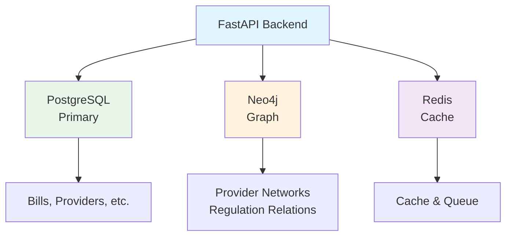
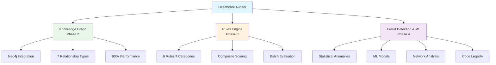
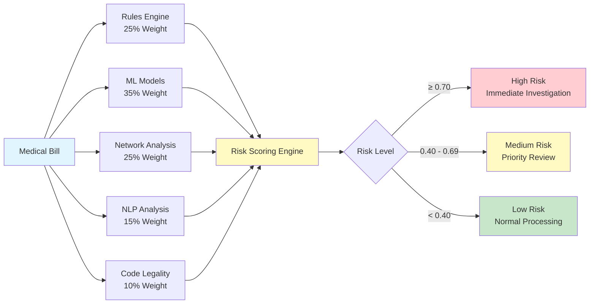

# Healthcare Auditor Wiki

**Tags**: #documentation #installation #architecture #api #configuration #development #testing #deployment #troubleshooting #healthcare #fraud-detection

Welcome to the Healthcare Auditor documentation wiki. This comprehensive healthcare billing fraud detection and compliance verification system combines rule-based validation, knowledge graph analysis, and machine learning to identify suspicious billing patterns.

## 📚 Documentation

### Getting Started
- **[Installation Guide](Installation.md)** - Set up your development environment
- **[Quick Start](#quick-start)** - Get up and running in 5 minutes
- **[Architecture Overview](Architecture.md)** - Understand the system design

### Core Features
- **[Knowledge Graph](#knowledge-graph)** - Neo4j-based provider network analysis
- **[Rules Engine](#rules-engine)** - 9 validation rules across 4 categories
- **[Fraud Detection & ML](#fraud-detection--ml)** - Statistical anomalies, ML models, and risk scoring
- **[API Reference](API-Reference.md)** - Complete API documentation

### Guides
- **[Development Guide](Development-Guide.md)** - Coding standards and contribution workflow
- **[Testing Guide](Testing-Guide.md)** - Testing practices and running tests
- **[Configuration Guide](Configuration.md)** - Environment variables and settings
- **[Deployment Guide](Deployment-Guide.md)** - Production deployment instructions

### Reference
- **[Troubleshooting](Troubleshooting.md)** - Common issues and solutions
- **[State Machines](#state-machines)** - System state machine diagrams
- **[Contributing](Contributing.md)** - Contribution guidelines

---

## 🚀 Quick Start

### Prerequisites

- Python 3.11+
- PostgreSQL 14+
- Neo4j 5.x
- Redis 7+
- Docker (optional)

### Installation

```bash
# Clone repository
git clone https://github.com/calebrosario/healthcare-auditor.git
cd healthcare-auditor

# Create virtual environment
python -m venv venv
source venv/bin/activate  # On Windows: venv\Scripts\activate

# Install dependencies
cd backend
poetry install

# Configure environment
cp ../.env.example .env
# Edit .env with your settings

# Initialize databases
# PostgreSQL: Create database and run migrations
# Neo4j: Start Neo4j service

# Run tests
poetry run pytest tests/ -v
```

### Run the API

```bash
# Start development server
poetry run uvicorn backend.app.main:app --reload --port 8000

# API will be available at http://localhost:8000
# Interactive docs at http://localhost:8000/docs
```

---

## 🏗️ Architecture



**Technology Stack:**
- **Backend**: FastAPI with async PostgreSQL
- **Knowledge Graph**: Neo4j for entity relationships
- **Caching**: Redis 7
- **Task Queue**: Celery for async processing
- **Testing**: Pytest with pytest-asyncio
- **ML**: Scikit-learn, PyOD for anomaly detection

---

## 📊 Features



### Knowledge Graph (Phase 2 - Complete)
- ✅ Neo4j integration for provider networks
- ✅ Batch node and edge creation (900x performance improvement)
- ✅ 7 relationship types
- ✅ MERGE operations for idempotency
- ✅ Performance indexes and full-text search

### Rules Engine (Phase 3 - Complete)
- ✅ 9 rule implementations across 4 categories
- ✅ Rule chain with prioritization and early termination
- ✅ Composite fraud and compliance scoring
- ✅ Neo4j context enrichment
- ✅ Batch evaluation support
- ✅ 25+ unit tests

### Fraud Detection & ML (Phase 4 - Complete)
- ✅ Statistical anomaly detection (Z-score, Benford's Law, frequency spikes)
- ✅ ML models (Random Forest, Isolation Forest)
- ✅ Network analysis (PageRank centrality, Louvain communities)
- ✅ Code legality verification (CMS NCCI, fee schedules, LCD/NCD)
- ✅ Combined risk scoring (weighted ensemble)
- ✅ API endpoint enhancements with Phase 4 results

---

## ⚖️ Risk Scoring Workflow



---

## 🔌 Key API Endpoints

### Validate Bills
```http
POST /api/v1/bills/validate
Content-Type: application/json

{
  "patient_id": "PATIENT-001",
  "provider_npi": "1234567890",
  "insurer_id": 1,
  "procedure_code": "99214",
  "diagnosis_code": "I10",
  "billed_amount": 150.00,
  "bill_date": "2026-02-05T10:00:00Z"
}
```

**Response includes:**
- Fraud score and risk level
- Compliance score
- Code legality score
- ML fraud probability
- Network risk score
- Anomaly flags
- Phase 4 statistics

[See full API documentation →](API-Reference.md)

---

## 🎯 Rule Types

### Coding Rules
- ICD-10 format validation
- CPT code existence and status
- CPT-ICD pair validation

### Medical Necessity Rules
- Documentation completeness check
- Medical necessity score validation

### Frequency Rules
- Provider procedure frequency limits
- Patient procedure frequency limits

### Billing Rules
- Billing amount limit checks
- Exact and near-duplicate detection

---

## 📈 Performance Characteristics

| Operation | Expected Time | Notes |
|------------|----------------|-------|
| Load bill from PostgreSQL | 10-50ms | Indexed query |
| Enrich context (Neo4j) | 50-200ms | Depends on query complexity |
| Single rule evaluation | 1-5ms | Simple validation rules |
| Full rule chain | 10-50ms | 9 rules total |
| ML prediction | 10-50ms | Model inference |
| Network analysis | 50-200ms | Graph algorithms |
| Total per bill | 100-500ms | Target <1s |

---

## 🧪 Testing

```bash
# Run all tests
poetry run pytest tests/ -v

# Run specific test file
poetry run pytest tests/test_rules_engine.py -v

# Run with coverage
poetry run pytest tests/ --cov=backend/app --cov-report=html

# Run ML training script
python scripts/train_models.py --bootstrap

# Batch validate bills
python scripts/validate_bills.py --batch --input claims.json
```

[See testing guide →](Testing-Guide.md)

---

## 🔄 State Machines

The system uses state machines to manage complex workflows:

- **[Knowledge Graph Construction](../docs/KNOWLEDGE_GRAPH_STATE_MACHINE.md)** - 13 states for building the Neo4j graph
- **[Rules Engine](../docs/RULES_ENGINE_STATE_MACHINE.md)** - Validation workflow with rule prioritization
- **[ML Pipeline](../docs/ML_PIPELINE_STATE_MACHINE.md)** - Model training and prediction lifecycle

---

## 📖 Project Structure

```
healthcare-auditor/
├── backend/
│   ├── app/
│   │   ├── api/              # FastAPI endpoints
│   │   ├── core/             # Core components (rules_engine, neo4j, ml_models)
│   │   ├── models/           # SQLAlchemy models
│   │   ├── rules/            # Rule validators
│   │   ├── security/         # Authentication and authorization
│   │   └── config.py         # Configuration management
│   └── main.py              # FastAPI application
├── scripts/                 # Standalone scripts
│   ├── validate_bills.py     # Rules engine executor
│   ├── build_graph.py       # Knowledge graph builder
│   └── train_models.py      # ML model training
├── tests/                   # Test suite
├── docs/                    # Documentation
└── .env.example            # Environment configuration template
```

---

## 🗺️ Phase Progress

- ✅ **Phase 1**: Foundation & Setup
- ✅ **Phase 2**: Knowledge Graph Construction
- ✅ **Phase 3**: Rules Engine
- ✅ **Phase 4**: Fraud Detection & ML

---

## 🤝 Contributing

We welcome contributions! Please read our [Contributing Guide](Contributing.md) for details on our code of conduct and the process for submitting pull requests.

### Development Workflow

1. Fork the repository
2. Create a feature branch (`git checkout -b feature/amazing-feature`)
3. Commit your changes (`git commit -m 'feat: add amazing feature'`)
4. Push to the branch (`git push origin feature/amazing-feature`)
5. Open a Pull Request

---

## 📄 License

[Specify your license here]

---

## 🔗 Resources

- **[GitHub Repository](https://github.com/calebrosario/healthcare-auditor)**
- **[Issue Tracker](https://github.com/calebrosario/healthcare-auditor/issues)**
- **[CMS Program Integrity](https://www.cms.gov/fraud)**
- **[Healthcare Fraud Prevention Partnership](https://www.cms.gov/medicare/medicaid-coordination/healthcare-fraud-prevention-partnership)**

---

## ❓ Support

- 📖 **Documentation**: This wiki and inline code comments
- 🐛 **Bug Reports**: [GitHub Issues](https://github.com/calebrosario/healthcare-auditor/issues)
- 💬 **Discussions**: [GitHub Discussions](https://github.com/calebrosario/healthcare-auditor/discussions)
- 📧 **Email**: [support@example.com](mailto:support@example.com)

---

**Last Updated**: February 8, 2026
